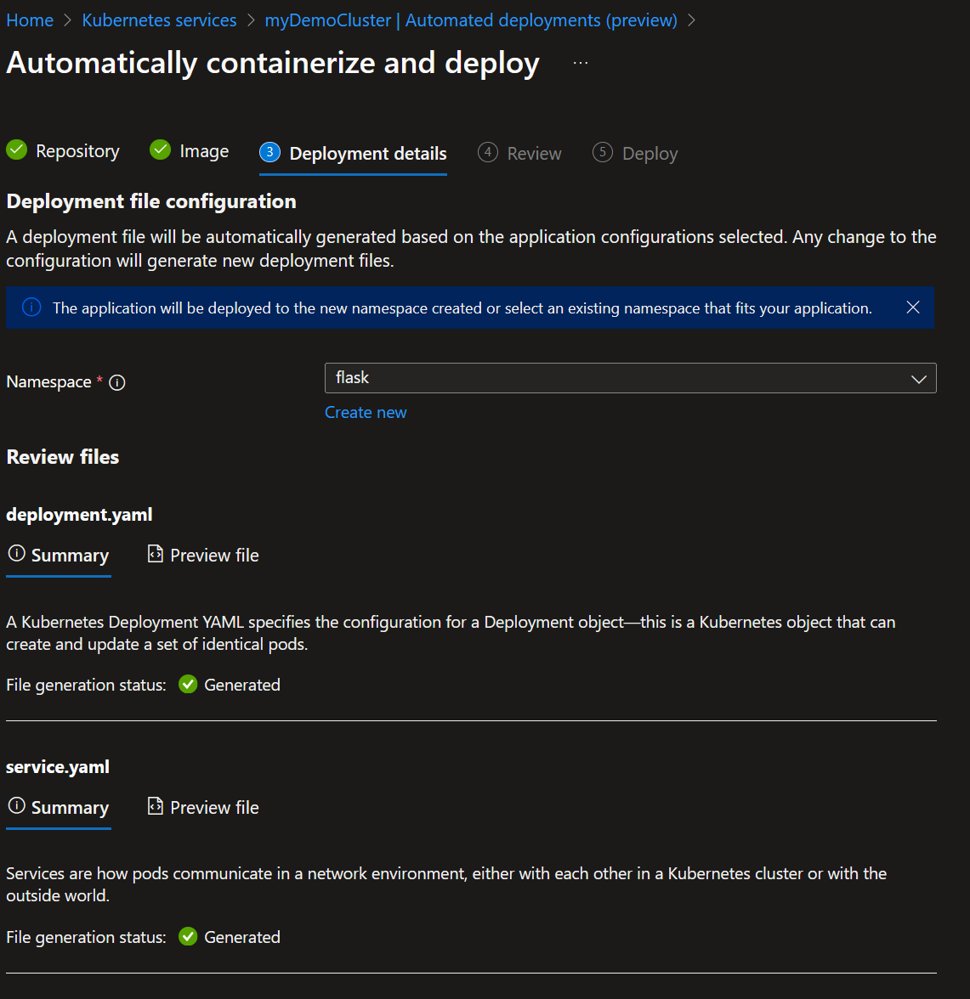
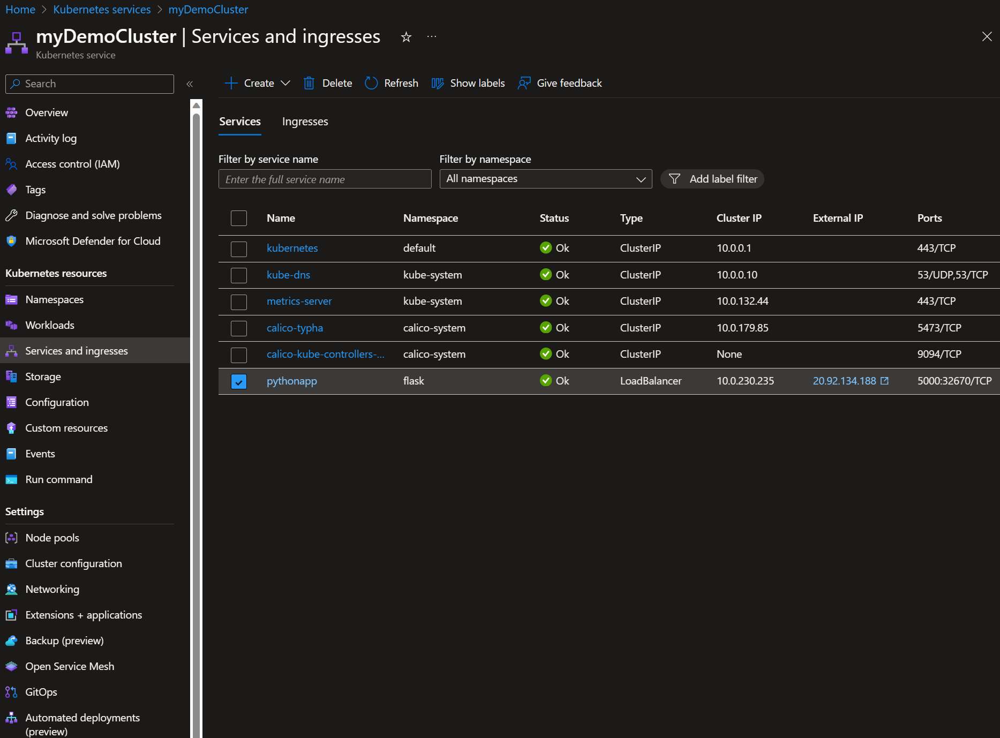
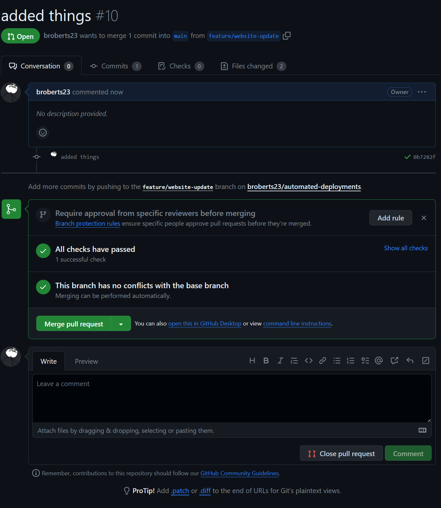

# Automated Deployments for Azure Kubernetes Service (Preview)

[link]<https://learn.microsoft.com/en-us/azure/aks/automated-deployments>

Deploying applications to a Kubernetes cluster can be a complex and time-consuming process. But with Azure Kubernetes Service (AKS), you can automate your deployments and save time and effort.

AKS provides a fully managed Kubernetes cluster that makes it easy to deploy, manage, and scale your applications. And with automated deployments, you can streamline your deployment process and reduce the risk of errors.

Automated deployments in AKS use a combination of Kubernetes features and Azure services to automate the deployment process. You can use Azure DevOps or GitHub Actions to create a pipeline that builds and deploys your application to AKS.

With automated deployments, you can:

- Reduce the need for Kubernetes expertise: Automated deployments eliminate the need for Kubernetes expertise by automating the build and deployment process.
- Reduce the risk of errors: Automated deployments eliminate the risk of human error by automating the deployment process.
- Save time and effort: Automating your deployments saves time and effort by eliminating the need for manual intervention.
- Increase consistency: Automated deployments ensure that your deployments are consistent and repeatable.

With automated deployments in AKS, you can streamline your deployment process and focus on what really matters: building great applications.

## Prerequisites

To complete this tutorial, you need:

- An Azure subscription.
- A GitHub account.
- An application to deploy. If you don't have an application to deploy, you can use the sample application in this tutorial.

## Create Azure resources

To create the Azure resources you need for this tutorial, use the following Azure CLI commands:

```bash
az group create --name myAKSDemo --location australiaeast
az aks create --resource-group myAKSDemo --name myAKSCluster --node-count 1 --enable-addons monitoring --generate-ssh-keys --kubernetes-version 1.28.0
az acr create --resource-group myAKSDemo --name automateddeployments --sku Basic
```

## Create a GitHub repository

For this demo we'll be using a (very) basic Flask app. Create a folder in the repo called "src" and a files named app.py and requirements.txt inside.

```python
from flask import Flask

app = Flask(__name__)


@app.route("/")
def hello_world():
    return "<h1>Hello World 2.0</h1>"


if __name__ == "__main__":
    app.run(debug=True)
```

```txt
Flask==2.3.3
```

Once you've commit those changes to your main branch we can move on to automated deployments configuration.

## Configure Automated Deployments

In the Azure Portal, select your cluster and click on the **Automated Deployments** tab. Click on **Automatically containerize and deploy** to start the setup.


After you've authenticated with GitHub, select the repository you want to use for the deployment.


The wizard will automatically detect environment runtime. Fill in the port and location for the app.

Don't forget to select the repo created above at the bottom of the page.


Create a new namespace for the project and proceed to the next step.



and click Deploy.


The automated deployment will now generate the credentials and set up permissions between GitHub Actions, the Container Registry and the AKS cluster.

The automated deployment will also create a pull request containing the new Dockerfile, GitHub Actions workflow and Kubernetes (yaml) manifest.

Clicking on "Approve pull request" will open the pull request in GitHub in a new tab.


Note: Azure auto-generated entrypoint/cmd won't work, update the Dockerfile to use the following instead.

```dockerfile
CMD [ "python3", "-m" , "flask", "run", "--host=0.0.0.0"]
```

Approve the merge and delete the branch then head to Action to see the build process.


The pipeline will build the Docker image, push it to ACR and deploy it to AKS.
After a few minites the deployment will be complete and the job status from the GitHub Actions pipeline will be reflected under the Automated Deployments tab in the Azure Portal.


You can start to see how you might scale this out by adding more apps in different repo and/or branches.

Head up to "Services and ingress" to get the public IP address of the app.



Clicking on the external IP will open a tab with the app.


Success! 🤜🤛 You've deployed an application to AKS using without any knowledge of Kubernetes or Docker!

## Automated Deployments

Now that we've got the basic configuration in place, let's take a look at how automated deployments work.

This is best explained by modifying the code in the GitHub repo and seeing how the automated deployment process works.

Make a change to app.py and commit the changes to a new branch and create a pull request.

```python
from flask import Flask

app = Flask(__name__)


@app.route("/")
def hello_world():
    return "<h1>Hello World 2.0</h1>"


if __name__ == "__main__":
    app.run(debug=True)
```

```bash
git checkout -b feature/website-update
```

```bash
git commit -am "added things"
```

```bash
git push --set-upstream origin feature/website-update
```



After completing the merge, observe the GitHub Actions pipeline.


and the Azure Portal.


After the build is complete, refresh the tab with the app to see the changes. 🪄


## All dressed up and nowhere to go

During the process of writing this blog I tried three times to get the automated deployment to work:

- The first time I used a Python app that I hadn't tested as a container,
- The second time I used a Node app that I had used on AKS before and,
- The third time I used a Go app that I had used with Docker.

Each time I ran into the same issue: the automated deployment process failed to generate a usable Dockerfile. So I had to troubleshoot the issue with Docker locally before I could move on. At this point you're probably wondering, "What's the point?" 🤔 Well... you're not alone.

Automated deployments completes the following four tasks:
    - Generates a Dockerfile
    - Generates a GitHub Actions (yaml) pipeline
    - Generates two Kubernetes manifest
    - Authenticates with GitHub Actions, ACR and AKS

Nothing "new" is being introduced here. I'd argue you could complete the same task with ChatGPT and a spare 30 minutes.

Given that you can't just "conainerize anything" there's a pretty good chance you're going to have to write your own Dockerfile and troubleshoot. If you're writing your own Dockerfile, you're probably going to want to write your own GitHub Actions pipeline. If you're writing your own GitHub Actions pipeline, you're probably going to want to write your own Kubernetes manifest. If you're writing your own Kubernetes manifest, you're probably going to want to authenticate with GitHub Actions, ACR and AKS. If you're writing... you get the point.

I havn't even addressed the issue of DevSecOps and the lack of any security scanning in the pipeline.

## Conclusion

Automated Deployments feels like a solution looking for a problem. It's a great idea and the automation to generate the verious files and pull request integration works really well but it feels a bit... lost. I'd love to see this feature get some love and attention from the product team. The wizard needs integration with an ingress controller to make it more then just a pod running on a cluster for a start. But at that point I can't help wonder if it's just easier to use Container Apps? 🤷

## Clean up resources

When no longer needed, you can use the following command to remove the resource group, AKS cluster, and all related resources.

```bash
az group delete --name myAKSDemo --yes --no-wait
```
