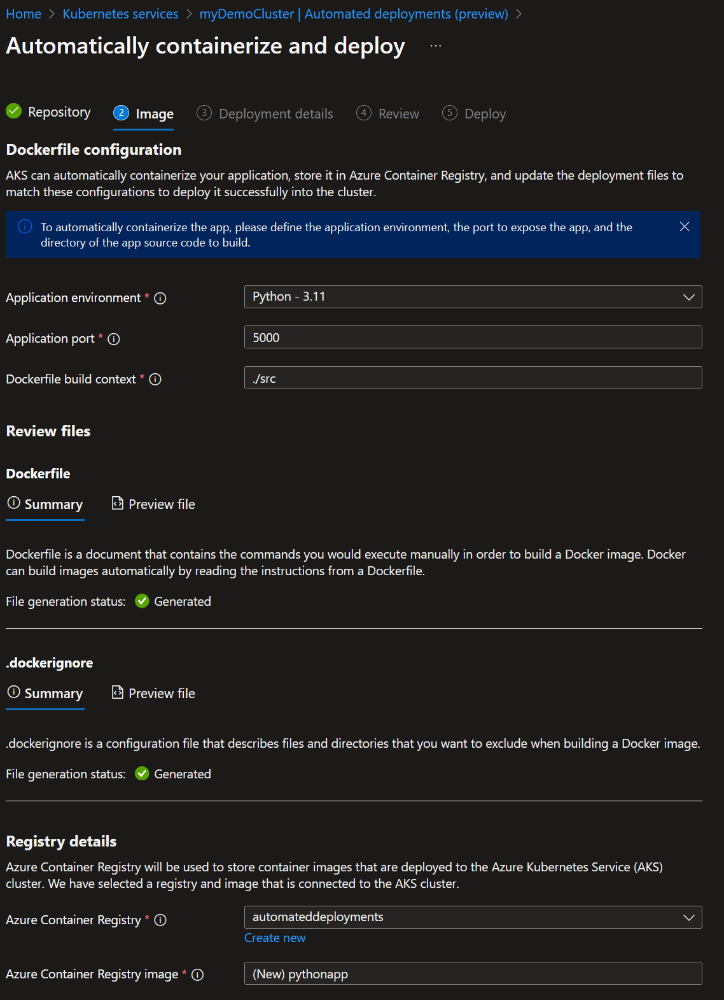

# Automated Deployments for Azure Kubernetes Service (Preview)

[link]<https://learn.microsoft.com/en-us/azure/aks/automated-deployments>

Deploying applications to a Kubernetes cluster can be a complex and time-consuming process. But with Azure Kubernetes Service (AKS), you can automate your deployments and save time and effort.

AKS provides a fully managed Kubernetes cluster that makes it easy to deploy, manage, and scale your applications. And with automated deployments, you can streamline your deployment process and reduce the risk of errors.

Automated deployments in AKS use a combination of Kubernetes features and Azure services to automate the deployment process. You can use Azure DevOps or GitHub Actions to create a pipeline that builds and deploys your application to AKS.

With automated deployments, you can:

- Reduce the need for Kubernetes expertise: Automated deployments eliminate the need for Kubernetes expertise by automating the build and deployment process.
- Reduce the risk of errors: Automated deployments eliminate the risk of human error by automating the deployment process.
- Save time and effort: Automating your deployments saves time and effort by eliminating the need for manual intervention.
- Increase consistency: Automated deployments ensure that your deployments are consistent and repeatable.

With automated deployments in AKS, you can streamline your deployment process and focus on what really matters: building great applications.

## Prerequisites

To complete this tutorial, you need:

- An Azure subscription.
- A GitHub account.
- An application to deploy. If you don't have an application to deploy, you can use the sample application in this tutorial.

## Create Azure resources

To create the Azure resources you need for this tutorial, use the following Azure CLI commands:

```bash
az group create --name myAKSDemo --location australiaeast
az aks create --resource-group myAKSDemo --name myAKSCluster --node-count 1 --enable-addons monitoring --generate-ssh-keys --kubernetes-version 1.28.0
az acr create --resource-group myAKSDemo --name automateddeployments --sku Basic
```

## Create a GitHub repository

For this demo I'll be using the [AKS Voting App](https://github.com/azure-samples/aks-voting-app/tree/master/) sample application. Start by forking the repo to your own GitHub account.

After the repo has been forked and all the Azure resources have been deployed, head over to the Azure Portal to complete the setup.

## Configure Automated Deployments

In the Azure Portal, select your cluster and click on the **Automated Deployments** tab. Click on **Automatically containerize and deploy** to start the setup.


After you've authenticated with GitHub, select the repository you want to use for the deployment.


The wizard will automatically detect environment runtime. Fill in the port and location for the app.

Don't forget to select the repo created above at the bottom of the page.



Create a new namespace for the project and proceed to the next step.


and click Deploy.


The automated deployment will now generate the credentials and set up permissions between GitHub Actions, ACR and the AKS cluster.

The automated deployment will also create a pull request contain the new Dockerfile, GitHub Actions workflow and Kubernetes (yaml) manifest.

Clicking on "Approve pull request" will open the pull request in GitHub in a new tab.


Approve the merge and delete the branch then head to Action to see the build process.


The pipeline will build the Docker image, push it to ACR and deploy it to AKS.
After a few minites the deployment will be complete and the job status from the GitHub Actions pipeline will be reflected under the Automated Deployments tab in the Azure Portal.


You can start to see how you might scale this out by adding more apps in different repo and/or branches.

Head up to Services and ingress to get the public IP address of the app.


## Clean up resources

When no longer needed, you can use the following command to remove the resource group, AKS cluster, and all related resources.

```bash